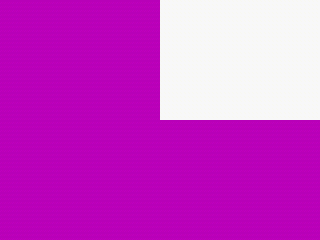

# GoldenRecomp — macOS port (work in progress)

Native macOS port of GoldenEye 007 (N64) using static recompilation via [N64ModernRuntime](https://github.com/Mr-Wiseguy/N64ModernRuntime) + [RT64](https://github.com/rt64/rt64).

> **This is a fork of [kholdfuzion/GoldenRecomp](https://github.com/kholdfuzion/GoldenRecomp).** All upstream credit goes to kholdfuzion and contributors. This fork focuses on getting the project running natively on **macOS (Apple Silicon)**. **Android** is a longer-term goal once macOS is playable.

## Status

🟡 **Pipeline validated, scene rendering not yet visible.** The full render pipeline works end-to-end (proven via diagnostic shaders), but actual game-scene triangles aren't producing visible textured pixels yet. Boot fillrects render in ~40-50% of runs.

| Component | Status |
|---|---|
| macOS app bundle (Apple Silicon) | ✅ builds, signs, launches |
| Recompiled GE 007 binary | ✅ runs, advances frames intermittently |
| RT64 + N64ModernRuntime stack | ✅ integrated |
| F3D_Gold opcode handlers (0xB1 G_TRIX, 0xBD remap) | ✅ implemented |
| DL pipeline (submit → walker → fbPair → fullSync) | ✅ validated |
| FB write path (RDRAM → VI display) | ✅ validated (see [docs/screenshots/fb-marker-validation.png](docs/screenshots/fb-marker-validation.png)) |
| Triangle rasterization | ✅ validated (see [docs/screenshots/force-magenta-validation.png](docs/screenshots/force-magenta-validation.png)) |
| Animation stall fix | ⚠️ non-deterministic (1 vs 152 DONEs across runs) |
| Texture loading | ⚠️ loads from corrupt addresses (low-bits-0xB pattern) |
| Combiner producing scene output | ❌ alpha cascade = 0 → coverage discard |
| Scene triangles reaching pixel shader | ❌ not in current "stalled-but-advancing" runs |
| Visible game scene | ❌ |

### What you'll see if you run it today

- A signed `GoldenRecomp.app` that launches normally
- Boot logo flashes (white rectangles) in some frames
- ~40-50% of runs produce a frame with 250k+ non-zero pixels (uniform fills, not yet game scene)
- Console logs documenting every stage of the pipeline

Example visible frame (boot fillrect with shade override):



This is **not** game scene rendering yet — it's the boot transition through the pipeline with our diagnostic shader producing visible output. See [docs/INVESTIGATION.md](docs/INVESTIGATION.md) for the full picture.

## Why GoldenEye is hard

GoldenEye 007 uses **Rare's custom F3D_Gold microcode**, which no public renderer (RT64, libultraship, GLideN64, etc.) fully understands. Compare:

| Game | Microcode | Native port status |
|---|---|---|
| Banjo-Kazooie | Stock F3DEX | ✅ [BanjoRecomp](https://github.com/BanjoRecomp/BanjoRecomp) works |
| Banjo-Tooie | Stock F3DEX2 | ✅ same stack works |
| Perfect Dark | Custom F3D_PD | ✅ [PD port](https://github.com/fgsfdsfgs/perfect_dark) custom-handles this |
| **GoldenEye 007** | **Custom F3D_Gold** | 🟡 the outlier — this project |

F3D_Gold is the only Rare N64 microcode without an established native port. Cracking it requires reading the actual RSP assembly at [n64decomp/007 `rsp/graphics/gmain.s`](https://github.com/n64decomp/007/blob/main/rsp/graphics/gmain.s).

## Quick start (try it now)

Requirements:
- macOS 14+ (Apple Silicon)
- CMake 3.20+, Ninja
- Xcode + Metal toolchain (`xcodebuild -downloadComponent MetalToolchain`)
- A TLB-free GE 007 ROM — build from [kholdfuzion/goldeneye_src @ TBLFREE_NOCOMPRESSION](https://github.com/kholdfuzion/goldeneye_src/compare/TBLFREE_NOCOMPRESSION)

```bash
git clone --recurse-submodules https://github.com/mgrz18/GoldenRecomp
cd GoldenRecomp

# Place ge007.tlbfree.elf and ge007.tlbfree.z64 at repo root.

# Generate recompiled sources (use mgrz18/N64Recomp@mac-port)
N64Recomp us.toml
N64Recomp us.toml --dump-context
RSPRecomp aspMain.us.toml

# Build
cmake -B build -G Ninja -DCMAKE_BUILD_TYPE=RelWithDebInfo
ninja -C build GoldenRecomp

# Run with the env-var combo that produces visible content (~40-50% rate)
GE_FORCE_SHADE=1 GE_RAW_VTX_COLOR=1 GE_DEEP_SHADOW=1 GE_REMAP_VTX=1 GE_LOCK_MATRICES=1 GE_DUMP_ALL=1 \
  ./build/GoldenRecomp.app/Contents/MacOS/GoldenRecomp -level_10
```

PPM dumps land in `/tmp/ge_fb_NNNN.ppm`. Convert with `sips -s format png /tmp/ge_fb_*.ppm` (macOS native).

## Forked submodules

This repo carries cumulative changes across all submodules to enable macOS builds:

| Submodule | Origin | Fork |
|---|---|---|
| `lib/rt64` | [rt64/rt64](https://github.com/rt64/rt64) | [mgrz18/rt64@mac-port](https://github.com/mgrz18/rt64/tree/mac-port) |
| `lib/N64ModernRuntime` | [kholdfuzion/N64ModernRuntime](https://github.com/kholdfuzion/N64ModernRuntime) | [mgrz18/N64ModernRuntime@mac-port](https://github.com/mgrz18/N64ModernRuntime/tree/mac-port) |
| `…/N64Recomp` (nested) | [N64Recomp/N64Recomp](https://github.com/N64Recomp/N64Recomp) | [mgrz18/N64Recomp@mac-port](https://github.com/mgrz18/N64Recomp/tree/mac-port) |
| `…/hlslpp` (nested) | [redorav/hlslpp](https://github.com/redorav/hlslpp) | [mgrz18/hlslpp@mac-port](https://github.com/mgrz18/hlslpp/tree/mac-port) |

## For contributors

**Open blockers** (each has a GitHub issue with full context):

1. [Make stall fix deterministic](../../issues) — bossMainloop sometimes gets 1 DONE per run, sometimes 152
2. [Scene triangles not reaching pixel shader](../../issues) — rainbow-test confirms tris don't render in stall-recovered frames
3. [F3D_Gold w1 encoding mystery](../../issues) — low-bits-0xB pattern in matrices, vertices, textures
4. [Combiner producing alpha=0](../../issues) — coverage discard kills every fragment
5. [Texture data corruption](../../issues) — loadBlock src=0x0060FFFB heap-aliased pattern
6. [Real perspective without div/0](../../issues) — modelview translate + near/far tuning

Read [docs/INVESTIGATION.md](docs/INVESTIGATION.md) for the consolidated technical knowledge from prior sessions: F3D_Gold spec extracted from `gmain.s`, all diagnostic env vars, hypothesis matrix, and pipeline diagrams.

## Roadmap

- [ ] Solve at least one of the 6 open blockers → real game scene visible
- [ ] Audio
- [ ] Input mapping (modern dual-analog)
- [ ] Multiplayer UI
- [ ] Skybox in DAM / Sky+Water in Frigate (custom RDP commands)
- [ ] Gun fire-rate fix (60Hz native vs 30Hz original timing)
- [ ] **Android port** (planned once macOS is playable)

## Building & running notes

The project builds but does not yet produce playable output. The diagnostic env-var combo above is the best-known config; without those env vars the screen stays mostly black.

**Diagnostic env vars** (full list in [docs/INVESTIGATION.md](docs/INVESTIGATION.md)):
- `GE_DEEP_SHADOW=1` — required, snapshots DL+matrix+vertex into shadow region
- `GE_REMAP_VTX=1` — required, redirects vertex addresses to shadow snapshot
- `GE_LOCK_MATRICES=1` — recommended, drops game matrices for injected ortho
- `GE_FORCE_SHADE=1` — required for vertex colors to propagate
- `GE_RAW_VTX_COLOR=1` — bypass lights producing zero RGB
- `GE_DUMP_ALL=1` — dump every FB to PPM (vs sparse default)
- `GE_FORCE_FB_MARKER=1` — stamp diagnostic block to validate FB path

## License

GPL-3.0 (inherited from upstream).

## Credits

- [kholdfuzion](https://github.com/kholdfuzion) — original GoldenRecomp project, decomp branch, N64Recomp modifications
- [Mr-Wiseguy](https://github.com/Mr-Wiseguy) — N64ModernRuntime, N64Recomp
- [rt64](https://github.com/rt64/rt64) — RT64 renderer
- [n64decomp](https://github.com/n64decomp) team — GoldenEye 007 decompilation reference
- theboy — earlier upstream contributions referenced in `patches/workbench_theboy.c`

This fork's investigation, instrumentation, and macOS-port work were carried out with assistance from [Claude](https://claude.com) (Anthropic) — primarily for reverse-engineering F3D_Gold microcode, scheduler debugging, and diagnostic infrastructure.
